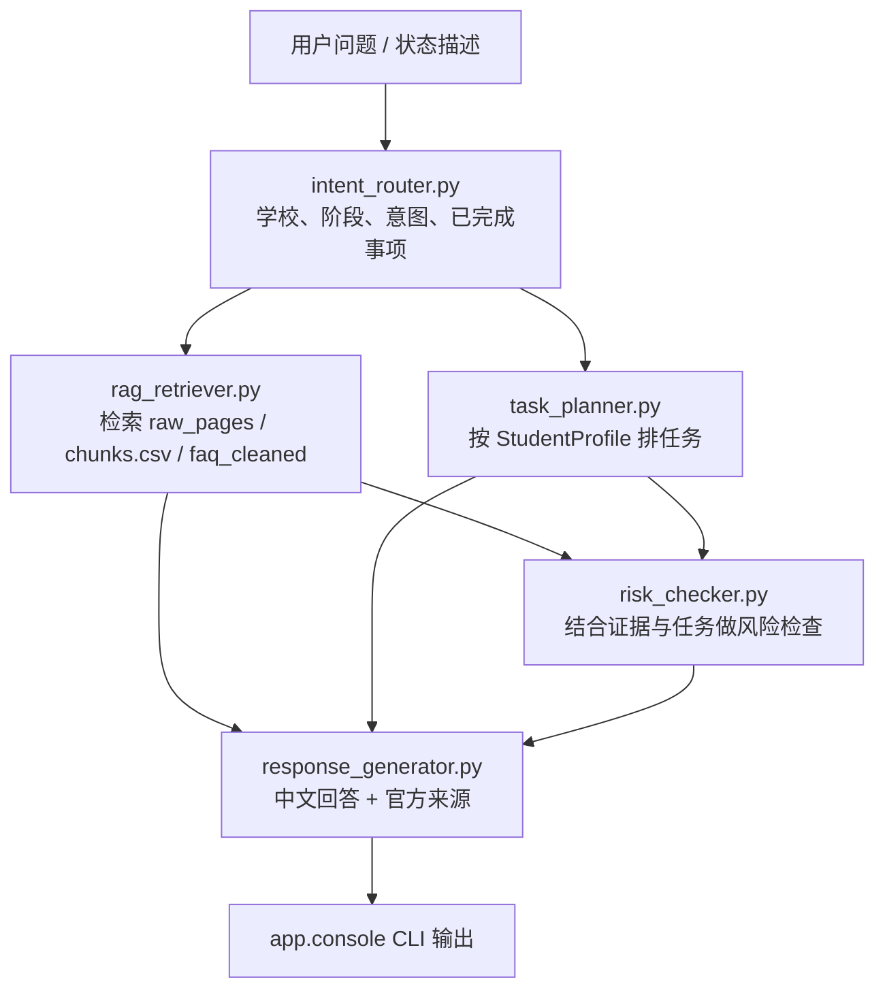

# 初步 Agent 实现记录（2026-06-29）

项目：基于 RAG 与任务流规划的港校 Offer Holder 入学准备 Agent

本文件记录当前“初步可运行 Agent”的设计、文件位置、运行命令和后续优化路线。当前版本仍是教学/原型向实现：使用规则路由、本地官方页面检索、任务模板和风险规则，不调用外部 LLM，也不接 Chroma / FAISS。

2026-06-29 更新：

- 已加入 PDF 正文抽取和 FAQ 候选抽取。HKU `mr_guide.pdf` 这类 registration PDF 现在可以进入 `raw_pages` 与 `knowledge_base/chunks.csv`。
- 已加入 Playwright 浏览器渲染采集。CityUHK 这类普通 HTTP 请求被 WAF/JS 影响的页面，现在可以通过浏览器采集进入 raw_pages。
- 已加入 FAQ 清洗评分和结构化 FAQ 入库。`faq_cleaned.csv` 会作为独立的 `faq_cleaned` chunk 合并进 `knowledge_base/chunks.csv`。

## 1. 当前版本边界

已经实现：

- 从第一阶段爬取结果 `data/raw_pages/*.txt` 构建本地检索块。
- 从 PDF 官方资料中抽取正文，写入同样的 raw text 归档格式。
- 从 FAQ 页面初步抽取 question / answer 候选并写入 `data/cleaned/faq.csv`。
- 清洗 FAQ 候选、生成质量报告，并输出 `data/cleaned/faq_cleaned.csv`。
- 将结构化 FAQ 作为独立检索块合并进 `knowledge_base/chunks.csv`。
- 对 CityUHK 动态/受保护页面进行浏览器渲染采集。
- 识别用户问题里的学校、阶段、任务规划意图和部分已完成状态。
- 根据学生状态生成下一步任务清单。
- 给出高风险事项提醒。
- 从本地官方页面归档中检索依据片段，并附来源 URL。
- 提供命令行入口，方便快速试跑。

暂未实现：

- 真实向量检索。
- LLM 生成个性化长回答。
- 自动从官网抽取精确 deadline / 金额 / 表格要求。
- 读取学生私人邮件、portal 或 offer letter。

## 2. 技术流程



## 3. 关键文件

| 文件 | 作用 |
|---|---|
| `agent/intent_router.py` | 轻量意图识别：学校别名、阶段关键词、待办信号、已完成状态推断。 |
| `agent/rag_retriever.py` | 本地检索器：解析 raw page 元数据、结构化 FAQ、切块、关键词扩展、打分、导出 chunks。 |
| `agent/task_planner.py` | 任务规划器：Offer 后核心任务模板、学校 URL 映射、优先级排序、导出 tasks.csv。 |
| `agent/risk_checker.py` | 风险规则：offer、deposit、conditional、visa、registration 等阻塞项。 |
| `agent/response_generator.py` | 把结构化结果组织成中文答复，并列出官方依据片段。 |
| `app/console.py` | 命令行入口：单次问答、交互模式、构建 KB、导出任务模板、抽取/清洗 FAQ、生成审计报告。 |
| `knowledge_base/build_chunks.py` | 单独的 chunks 构建脚本。 |
| `crawler/dynamic_crawl_pages.py` | 使用 Playwright 浏览器渲染采集 WAF / JS 页面。 |
| `knowledge_base/extract_faq.py` | 从 raw page 文本中抽取 FAQ 候选。 |
| `knowledge_base/clean_faq.py` | 清洗 FAQ 候选、评分、去重，并输出可入库 FAQ 与人工复核报告。 |
| `crawler/summarize_crawl.py` | 从追加式 crawl log 生成每个 source 的最新状态汇总。 |
| `knowledge_base/audit_data_quality.py` | 审计 source、raw text、chunks、FAQ、tasks 的覆盖度。 |
| `knowledge_base/chunks.csv` | 已生成的本地检索块归档。 |
| `data/cleaned/tasks.csv` | 已生成的 8 校初始任务模板归档。 |
| `data/cleaned/faq_cleaned.csv` | 已清洗、可入库的结构化 FAQ。 |
| `data/metadata/crawl_summary.csv` | 当前 source_list 的最新采集状态。 |
| `data/metadata/data_quality_report.csv` | 数据覆盖度审计报告。 |
| `data/metadata/faq_quality_report.csv` | FAQ 清洗评分和 keep/review/reject 决策报告。 |
| `tests/test_initial_agent.py` | 初步 Agent 单元测试。 |

## 4. 已执行步骤

### 步骤 1：实现意图识别

文件：`agent/intent_router.py`

核心设计：

- 学校别名表覆盖 HKU、CUHK、HKUST、CityU、PolyU、HKBU、Lingnan、EdUHK。
- 阶段包括 `offer_acceptance`、`visa`、`housing`、`payment`、`registration`、`orientation`、`faq`。
- 对“还没 / 尚未 / not yet + 阶段关键词”加权，避免用户已经完成的事项抢走当前待办阶段。
- 从用户话里推断 `accepted_offer`、`paid_deposit`、`visa_submitted` 等状态。

### 步骤 2：实现本地检索

文件：`agent/rag_retriever.py`

核心设计：

- 读取第一阶段保存的 raw text 文件。
- 如果存在 `data/cleaned/faq_cleaned.csv`，额外读取结构化 FAQ 并生成 `page_type=faq_cleaned` 的检索块。
- 解析文件头部元数据：school、page_type、stage、source_url、title。
- 按约 900 字符切块，并保留轻微 overlap。
- 中文查询会扩展到英文官网常用词，例如“签证”扩展为 `visa / entry permit / immigration`。
- 打分因素包括关键词命中、学校匹配、页面类型匹配、阶段匹配。

生成命令：

```powershell
.\.venv\Scripts\python -m app.console --build-kb
```

当前生成结果：

- `knowledge_base/chunks.csv`
- 786 条 chunks，其中 563 条来自 raw pages，223 条来自 `faq_cleaned.csv`
- raw page chunks 包含 HKU registration PDF、CityU 动态采集页面和更新后的 Lingnan FAQ 页面

### 步骤 3：实现任务规划

文件：`agent/task_planner.py`

核心任务模板：

1. 接受 offer 并确认入读意向
2. 缴纳留位费 / admission deposit
3. 补交 conditional offer 材料
4. 申请学生签证 / 进入许可
5. 申请宿舍或安排校外住宿
6. 核对并缴纳学费 / 其他费用
7. 完成线上注册 / 学籍激活
8. 准备入境与参加 orientation

生成命令：

```powershell
.\.venv\Scripts\python -m app.console --export-seed-tasks
```

当前生成结果：

- `data/cleaned/tasks.csv`
- 8 所学校 x 8 类任务 = 64 条任务模板

### 步骤 4：实现风险检查

文件：`agent/risk_checker.py`

当前风险规则偏保守，重点提醒：

- 未接受 offer。
- 未交留位费。
- 明确 conditional offer 但未完成条件。
- 内地学生未递交 student visa / entry permit。
- 签证已递交但未获批。
- 线上注册 / 学籍激活未完成。
- 本地资料库没有检索到对应官方依据。

### 步骤 5：实现回答生成

文件：`agent/response_generator.py`

回答包含：

- 当前识别的学校 / 阶段。
- 下一步优先任务。
- 风险提醒。
- 官方依据片段与来源 URL。
- 明确提醒：日期、金额、资格以 offer letter、portal、学院邮件为准。

### 步骤 6：提供 CLI

文件：`app/console.py`

示例：

```powershell
.\.venv\Scripts\python -m app.console `
  --school HKUST `
  --message "我已经接受offer，也交了留位费，还没申请签证，下一步做什么？" `
  --top-k 3 `
  --task-limit 4
```

也可以进入交互模式：

```powershell
.\.venv\Scripts\python -m app.console --interactive --school HKUST
```

### 步骤 7：加入 PDF 抽取

文件：`crawler/crawl_pages.py`

新增能力：

- 支持 `application/pdf` 和 URL 以 `.pdf` 结尾的官方资料。
- 使用 `pypdf.PdfReader` 提取每页文本。
- 与 HTML 页面一样写入 `data/raw_pages/*.txt`，保留 metadata header。
- raw text header 增加 `content_type` 和 `extraction_method`，方便后续区分来源。

运行示例：

```powershell
.\.venv\Scripts\python -m crawler.crawl_pages `
  --school HKU `
  --page-type registration `
  --force `
  --timeout 40 `
  --delay 0.5
```

验证结果：

- HKU registration PDF 抽取成功。
- `data/raw_pages/hku__registration__08e6451d08.txt` 本地生成，正文约 6,198 字符。
- 重建知识库后，HKU registration chunks 可被 RAG 检索。

### 步骤 8：加入 FAQ 候选抽取

文件：`knowledge_base/extract_faq.py`

新增能力：

- 读取 `data/raw_pages/*.txt` 的 metadata 与正文。
- 默认只扫描 `page_type=faq` 页面。
- 识别英文/中文问题行，例如 `What ...?`、`How ...?`、`Q1:`、`如何...？`。
- 将问题后续文本合并为答案，写入 `data/cleaned/faq.csv`。
- 按关键词推断 `category` 与 `risk_level`。

运行示例：

```powershell
.\.venv\Scripts\python -m app.console --extract-faq
```

当前抽取结果：

- `data/cleaned/faq.csv`
- 231 条 FAQ 候选
- 学校分布：CityU 62、CUHK 51、PolyU 46、HKU 31、HKBU 27、Lingnan 10、HKUST 2、EdUHK 2
- 类别分布：general 95、offer_acceptance 53、visa 41、payment 32、housing 7、registration 3

### 步骤 9：加入浏览器渲染采集

文件：`crawler/dynamic_crawl_pages.py`

新增能力：

- 使用 Playwright Chromium 打开页面并等待 DOM 渲染。
- 默认只采集 `source_list.csv` 中 `need_dynamic=yes` 的数据源。
- 支持 `--school`、`--page-type`、`--max-priority`、`--limit`、`--force` 等筛选参数。
- 写入与静态爬虫一致的 raw text 文件，并在 header 中标注 `extraction_method: browser_playwright`。
- 继续追加写入 `data/metadata/crawl_log.csv`。
- 仍会检查 `robots.txt`，除非显式传入 `--ignore-robots`。

首次安装：

```powershell
.\.venv\Scripts\python -m pip install -r requirements.txt
.\.venv\Scripts\python -m playwright install chromium
```

运行示例：

```powershell
.\.venv\Scripts\python -m crawler.dynamic_crawl_pages --school CityU --force
```

当前 CityU 验证结果：

- `success_dynamic`: 7 个页面
- 生成 CityU raw text 文件 7 个
- CityU FAQ 页面约 41,719 字符
- CityU visa 页面约 8,197 字符
- 重建知识库后，CityU chunks 按 page_type 分布：faq 63、visa 12、accommodation 8、registration 5、admitted_student 4、tuition 4、orientation 4

### 步骤 10：加入最新状态汇总和数据质量审计

文件：

- `crawler/summarize_crawl.py`
- `knowledge_base/audit_data_quality.py`

新增能力：

- `crawl_log.csv` 保持追加式记录，保留所有历史尝试。
- `crawl_summary.csv` 按 `school + page_type + source_url` 汇总当前 `source_list.csv` 的最新状态。
- `data_quality_report.csv` 把 source、raw text、chunks、FAQ 和 task template 串起来做覆盖度检查。
- 覆盖度分为 `ok`、`weak`、`blocker`。
- `weak` 不代表抓取失败，通常表示正文较短、FAQ 候选不足或需要人工核验。

运行示例：

```powershell
.\.venv\Scripts\python -m app.console --summarize-crawl
.\.venv\Scripts\python -m app.console --audit-data
```

`--audit-data` 会先刷新 `crawl_summary.csv`，再生成 `data_quality_report.csv`。

当前结果：

- `data/metadata/crawl_summary.csv`：56 条 source 最新状态
- 最新爬取状态：40 个 `success`，16 个 `success_dynamic`
- `needs_attention`: 0
- `data/metadata/data_quality_report.csv`：56 条覆盖度审计
- 覆盖度：56 个 `ok`，0 个 `weak`，0 个 `blocker`
- HKUST FAQ 已通过用户提供的官方页面复制文本导入，不再是 weak source

### 步骤 11：处理 weak 页面

本轮针对 `data_quality_report.csv` 中的 7 个 `weak` 页面做了复核：

- EdUHK visa / accommodation / FAQ：改用浏览器渲染后正文从约 707 字符提升到约 1,276 字符。
- HKUST orientation：改用浏览器渲染后正文从约 339 字符提升到约 1,481 字符。
- Lingnan tuition / FAQ：TPG 首页改用浏览器渲染后正文提升；FAQ 进一步替换为官方更具体 URL `https://www.ln.edu.hk/sgs/tpg/applications/faqs`。
- HKUST FAQ：自动化请求会遇到 SafeLine WAF / HTTP 468；后续通过 manual capture 导入用户复制的官方页面文本。

对应更新：

- `source_list.csv`：EdUHK、HKUST orientation、Lingnan tuition/FAQ 的 `need_dynamic` 已更新。
- `knowledge_base/chunks.csv`：重建后为 563 条。
- `data/cleaned/faq.csv`：重建后为 231 条。

### 步骤 12：FAQ 清洗与结构化入库

文件：

- `knowledge_base/clean_faq.py`
- `agent/rag_retriever.py`
- `app/console.py`

新增能力：

- 对 `data/cleaned/faq.csv` 进行二次清洗，处理 `Q1:`、`A01.`、数字编号等常见前缀。
- 识别并降权/剔除过短问题、片段型问题、模板占位符、导航残留和同校重复问题。
- 生成 `data/metadata/faq_quality_report.csv`，保留原始问题、清洗后问题、质量分、`keep` / `review` / `reject` 决策与说明。
- 生成 `data/cleaned/faq_cleaned.csv`，只保存可直接入库的 FAQ。
- 构建知识库时自动把 `faq_cleaned.csv` 合并为结构化 FAQ chunks，`page_type=faq_cleaned`。

运行示例：

```powershell
.\.venv\Scripts\python -m app.console --clean-faq
.\.venv\Scripts\python -m app.console --build-kb
```

点击展开采集前的清洗结果：

- `data/cleaned/faq.csv`：231 条候选
- `data/cleaned/faq_cleaned.csv`：223 条保留
- `data/metadata/faq_quality_report.csv`：223 条 `keep`、5 条 `review`、3 条 `reject`
- `knowledge_base/chunks.csv`：786 条 chunks，其中 `faq_cleaned` 223 条

### 步骤 13：FAQ 点击展开采集与复核队列收口

文件：

- `crawler/expand_faq_pages.py`
- `crawler/import_manual_page.py`
- `tests/test_expand_faq_pages.py`
- `tests/test_import_manual_page.py`
- `data/metadata/manual_review_queue.csv`
- `docs/manual_review_guide.md`

新增能力：

- 用 Playwright 打开人工复核队列里的 FAQ 官方页面。
- 强制展开常见折叠结构：`details`、`.collapse`、`.accordion-collapse`、`[hidden]`、`aria-expanded=false` 等。
- 点击 FAQ-like 控件，例如编号问题、问号结尾问题，以及包含 offer / visa / transcript / tuition / admission 等关键词的按钮或链接。
- 清洗 HTML 时保留真实链接：`Please click here` 会变成 `Please click here (完整 URL)`。
- 对同页 accordion 锚点不追加 URL，避免 FAQ 问题本身被污染为 `问题 (#collapse-xx)`。
- 将结果写回标准 raw page 格式，`extraction_method=browser_faq_expand_click`。
- 对仍被 WAF 拦截但用户可手动复制的页面，使用 `crawler.import_manual_page` 导入，`extraction_method=manual_capture`。

运行示例：

```powershell
.\.venv\Scripts\python -m crawler.expand_faq_pages --from-manual-review --force
.\.venv\Scripts\python -m app.console --extract-faq
.\.venv\Scripts\python -m app.console --clean-faq
.\.venv\Scripts\python -m app.console --build-kb
```

人工导入示例：

```powershell
.\.venv\Scripts\python -m crawler.import_manual_page `
  --input "path\to\pasted-text.txt" `
  --school HKUST `
  --page-type faq `
  --source-url "https://fytgs.hkust.edu.hk/admissions/faq" `
  --title "FAQ | HKUST Fok Ying Tung Graduate School"
```

当前结果：

- CUHK FAQ：点击展开/链接保留成功，短答案补上官方目标链接。
- HKBU FAQ：点击 27 个 FAQ-like 控件后，raw text 从约 4,970 字符提升到约 31,675 字符。
- PolyU FAQ：页面正文本身较完整，链接保留后短答案补上官方目标链接。
- HKUST FAQ：通过用户提供的 pasted text 导入，raw text 约 10,058 字符。
- `data/cleaned/faq.csv`：252 条候选
- `data/cleaned/faq_cleaned.csv`：248 条保留
- `data/metadata/faq_quality_report.csv`：248 条 `keep`、4 条 `reject`、0 条 `review`
- `knowledge_base/chunks.csv`：847 条 chunks，其中 `faq_cleaned` 248 条

### 步骤 14：从官方 FAQ 抽取任务证据

文件：

- `knowledge_base/extract_task_evidence.py`
- `tests/test_extract_task_evidence.py`
- `data/cleaned/task_evidence.csv`

新增能力：

- 从 `data/cleaned/faq_cleaned.csv` 中抽取与入学准备任务相关的可审核证据。
- 暂不直接覆盖 `tasks.csv`，而是生成中间表 `task_evidence.csv`，方便人工复核后再回填任务模板。
- 初步识别任务类型：接受 offer、缴纳留位费、补交 conditional offer 材料、申请学生签证、申请住宿、缴纳学费、完成注册、orientation / arrival。
- 初步识别证据类型：操作链接、费用金额、deadline、所需文件、操作指引、来源上下文。

运行示例：

```powershell
.\.venv\Scripts\python -m app.console --extract-task-evidence
```

当前结果：

- `data/cleaned/task_evidence.csv`：446 条任务证据。
- 按任务类型：`submit_conditions` 186、`apply_student_visa` 128、`pay_tuition` 43、`pay_deposit` 31、`accept_offer` 21、`apply_accommodation` 19、`complete_registration` 18。
- 按证据类型：`action_instruction` 182、`deadline` 98、`required_document` 98、`action_url` 51、`source_context` 14、`fee_amount` 3。
- 这一步的目标是为后续 `tasks.csv` 的“官方依据化”做准备，而不是一次性自动改写任务表。

### 步骤 15：第一阶段归档元数据与字段字典

文件：

- `knowledge_base/phase1_outputs.py`
- `tests/test_phase1_outputs.py`
- `data/metadata/raw_page_index.csv`
- `data/metadata/phase1_manifest.csv`
- `data/metadata/schema_dictionary.csv`

新增能力：

- 为 `data/raw_pages/*.txt` 生成索引表，记录学校、页面类型、阶段、来源 URL、最终 URL、标题、正文长度、抽取方式和爬取时间。
- 为第一阶段输入/输出生成 manifest，记录 source list、raw pages、crawl log、summary、quality report、cleaned CSV、chunks、vector index、用户状态表等产物是否存在、行数/文件数、更新时间。
- 生成 CSV 字段字典，覆盖 `source_list.csv`、`crawl_log.csv`、`crawl_summary.csv`、`data_quality_report.csv`、`raw_page_index.csv`、`schools.csv`、`tasks.csv`、`tasks_enriched.csv`、`faq.csv`、`faq_cleaned.csv`、`task_evidence.csv`、`chunks.csv`、`vector_index.csv`、`user_states.csv`、`phase1_manifest.csv`。
- 接入 CLI：`app.console --prepare-phase1-outputs`。

运行示例：

```powershell
.\.venv\Scripts\python -m app.console --prepare-phase1-outputs
```

当前结果：

- `data/metadata/raw_page_index.csv`：57 条 raw page 索引。
- `data/metadata/phase1_manifest.csv`：17 条阶段产物清单。
- `data/metadata/schema_dictionary.csv`：187 条字段说明。
- 这一步把第一阶段第 3/4/5/6 项从“文件已经存在”推进为“可审计、可复跑、可交接的数据目录”。

### 步骤 16：生成证据增强任务表

文件：

- `knowledge_base/enrich_tasks.py`
- `tests/test_next_step_scaffolding.py`
- `data/cleaned/tasks_enriched.csv`

新增能力：

- 将 `data/cleaned/tasks.csv` 与 `data/cleaned/task_evidence.csv` 按 `school + task_code` 合并。
- 保留原始 `tasks.csv` 不动，输出 `tasks_enriched.csv` 作为人工复核副本。
- 新增字段包括 `evidence_count`、`evidence_types`、`official_deadline_evidence`、`official_document_evidence`、`official_action_evidence`、`official_action_urls`、`official_fee_evidence`、`evidence_ids`、`enrichment_status`。

运行示例：

```powershell
.\.venv\Scripts\python -m app.console --enrich-tasks
```

当前结果：

- `data/cleaned/tasks_enriched.csv`：64 条任务。
- 其中 35 条匹配到官方任务证据。
- 这张表仍需人工复核，尤其是 `pay_deposit`、`submit_conditions` 这类容易混入 general admission FAQ 的任务。

### 步骤 17：无依赖 sparse vector index 过渡层

文件：

- `knowledge_base/vector_index.py`
- `knowledge_base/vector_index.csv`

新增能力：

- 从 `knowledge_base/chunks.csv` 生成稀疏词频向量索引。
- 支持简单 cosine similarity 搜索，作为后续 Chroma / FAISS 接入前的可运行过渡层。
- 不新增依赖，不改变当前 RAG 检索主链路。

运行示例：

```powershell
.\.venv\Scripts\python -m app.console --build-vector-index
```

当前结果：

- `knowledge_base/vector_index.csv`：847 条向量索引记录。

### 步骤 18：LLM grounded prompt 边界层

文件：

- `agent/llm_prompt.py`
- `data/metadata/last_llm_prompt.md`

新增能力：

- 不直接调用外部 LLM，而是先把用户问题、识别出的状态、任务、风险、官方证据打包成 prompt。
- prompt 明确要求：不能编造日期、金额、材料或资格；必须基于官方证据；高风险事项以 offer letter、portal、学院邮件和官方 URL 为准。
- 后续接 OpenAI / 其他 LLM 时，可以复用这层 prompt 作为安全边界。

运行示例：

```powershell
.\.venv\Scripts\python -m app.console `
  --school HKUST `
  --message "我已经接受offer，也交了留位费，还没申请签证，下一步做什么？" `
  --export-llm-prompt
```

当前结果：

- `data/metadata/last_llm_prompt.md`：已生成一份 HKUST 签证场景 prompt 示例。

### 步骤 19：用户状态持久化骨架

文件：

- `agent/user_state.py`
- `data/cleaned/user_states.csv`

新增能力：

- 用 CSV 保存本地用户状态，字段包括 `user_id`、`school`、`origin`、`program_type`、`has_conditional_offer`、`completed_flags`、`notes`、`updated_at`。
- CLI 支持 `--load-user-state` 和 `--save-user-state`。
- 当前只建立表头，不写入虚假用户数据。

运行示例：

```powershell
.\.venv\Scripts\python -m app.console `
  --user-id demo_hkust `
  --school HKUST `
  --accepted-offer `
  --paid-deposit `
  --message "我下一步要做什么？" `
  --save-user-state
```

### 步骤 20：专业 agent 复核后的最小闭环修复

背景：

- `rag_agent` 确认：原检索逻辑可能仅靠学校、阶段、页面类型加分返回证据，存在 false grounding 风险。
- `task_flow_agent` 确认：`tasks_enriched.csv` 已生成，但主问答流程默认没有读取它。
- `kb_agent` 确认：`tasks_enriched.csv` 仍是候选证据表，不应直接当成已审核事实。
- `crawler_agent` 确认：crawler 的 WAF/PDF/FAQ 加固重要，但属于管线级改造，本轮暂不扩大范围。

文件：

- `agent/rag_retriever.py`
- `agent/task_planner.py`
- `agent/response_generator.py`
- `agent/llm_prompt.py`
- `app/console.py`
- `tests/test_initial_agent.py`
- `tests/test_next_step_scaffolding.py`

新增能力：

- RAG 检索必须在 `title + text` 中命中查询扩展词，`school/page_type/stage` 只用于 rerank，不能单独构成 evidence。
- 增加英文 stopwords 过滤，并补充常见中文/繁体中文 query expansion，如成绩单、毕业证、学位证、语言成绩、注册、学费等。
- `TaskPlanner` 增加可选 `task_source_csv`，默认仍使用内置模板；开启后可读取 `tasks_enriched.csv`。
- CLI 增加 `--use-enriched-tasks`，显式启用增强任务表，不改变默认行为。
- 回答中展示 `official_deadline_evidence`、`official_document_evidence`、`official_action_evidence` 等字段时，明确标为“官方候选证据”。
- grounded prompt 强化规则：涉及 deadline、金额、材料、资格、步骤或风险的结论必须绑定 Evidence ID 和 source URL；evidence block 增加 `chunk_id` 和 `matched_terms`。

运行示例：

```powershell
.\.venv\Scripts\python -m app.console `
  --school HKUST `
  --message "我已经接受offer，也交了留位费，还没申请签证，下一步做什么？" `
  --use-enriched-tasks
```

新增测试覆盖：

- metadata-only match 不能作为 evidence 返回。
- stopword-only 英文查询不能召回无关证据。
- 中文“成绩单 / 学位证”能命中英文 transcript / degree certificate。
- prompt 中包含 Evidence ID、chunk_id、matched_terms。
- `TaskPlanner(task_source_csv=...)` 能读取 enriched 任务源。
- completed flags 同样能过滤 enriched 任务。

## 5. 当前验证结果

测试命令：

```powershell
.\.venv\Scripts\python -B -m unittest discover -s tests -v
.\.venv\Scripts\python -B -c "import ast; from pathlib import Path; roots=[Path('crawler'),Path('agent'),Path('app'),Path('knowledge_base'),Path('tests')]; files=[p for r in roots for p in r.rglob('*.py')]; [ast.parse(p.read_text(encoding='utf-8'), filename=str(p)) for p in files]; print(f'AST syntax OK: {len(files)} files')"
```

结果：

- 单元测试：50 个通过。
- AST 语法检查：通过。
- 示例问答：HKUST 已接受 offer、已交留位费、未申请签证时，第一优先任务正确落到“申请学生签证 / 进入许可”。
- 示例问答：CityU 内地学生签证问题能检索到 CityU visa 和 FAQ 动态采集证据。

## 6. 下一步优化建议

推荐按这个顺序推进：

1. 后续新增 FAQ 页面如出现短答案，优先运行 `crawler.expand_faq_pages`，再重新抽取、清洗和构建 KB。
2. 如页面仍被 WAF 拦截但用户能打开，使用 `crawler.import_manual_page` 导入人工复制的官方正文。
3. 人工复核 `data/cleaned/tasks_enriched.csv` 中的证据匹配质量，优先处理签证、offer acceptance、conditional offer。
4. 将 `knowledge_base/vector_index.py` 替换/升级为 Chroma 或 FAISS，并保留 sparse index 作为 fallback。
5. 接入真实 LLM API 时继续使用 `agent/llm_prompt.py` 的 grounded prompt 规则。
6. 在 `user_states.csv` 基础上增加 deadline、提醒时间和任务完成记录。
